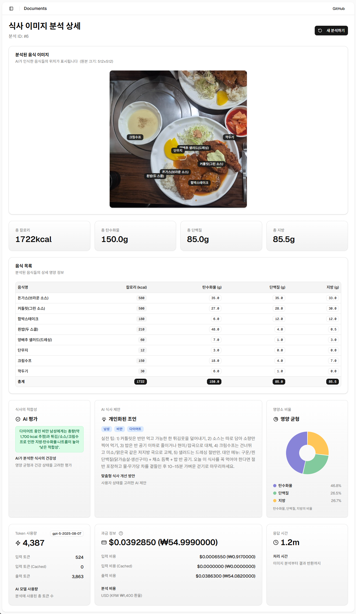
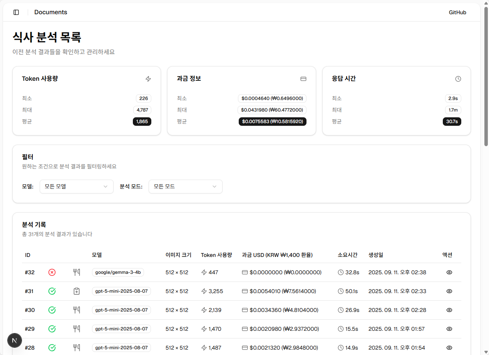

# Open AI LLM을 활용한 식사 이미지 분석

- 사용자의 상태와 식사이미지를 분석하여, 식사 정보(이름, 이미지상 위치, 칼로리, 탄단지)와 AI 시단 제안을 제공
- 이미지 분석에 사용한 Token 사용량을 제공





## 🍕 주요 라이브러리

- React
- Next.js
- shadcn/ui
- Tailwindcss

## 🍔 주요 리소스 구조

``` 
root
├─ .curosr.rules             # AI-Agent 가이드라인 프롬프트
├─ prompts                   # 기능 프롬프트
├─ apps.web
│  ├─ app.food               # 식사 이미지 분석  
│  └─ prompts                # API Swagger json 프롬프트
└─ packages                  # Core 패키지, shadcn/ui 패키지 
```

## 🍟 어플리케이션 실행

```
pnpm dev
```
